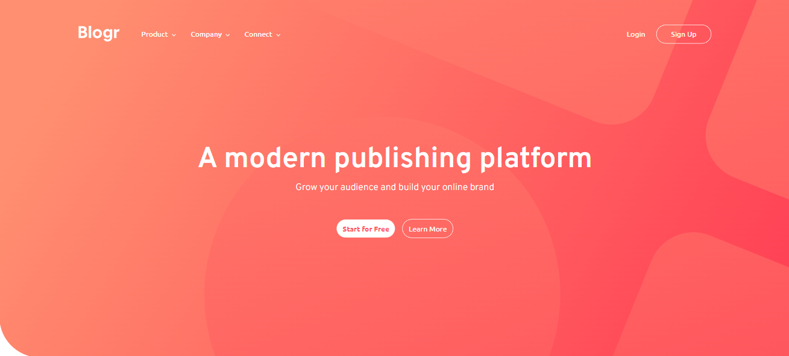
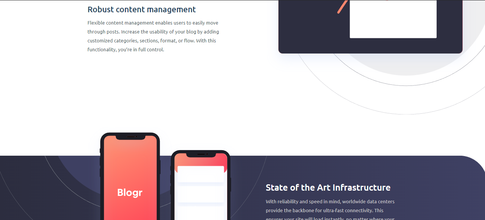
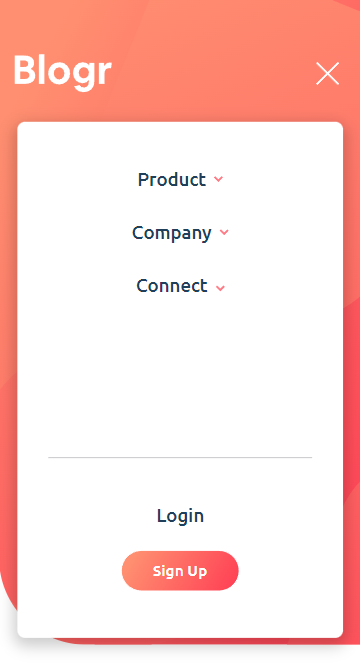

# **Frontend Mentor - Blogr Page**

Challenge do Frontend Mentor para a criação de uma landing page.

 

 

 

# **📄 Sobre o desafio**

Para completar o desafio, era preciso seguir o design mobile e desktop, incluindo menus dropdown e, para celular, um menu burger.  
O design é relativamente simples, apesar de exigir um bom conhecimento em responsividade para posicionar corretamente as SVGs de cada seção com **position absolute**.
  
Escolhi este desafio para aprender VueJs.
 
 

# **📷 Screenshots**

 

 

# **🌎 Acesso**

A aplicação está hospedada no Netlify e pode ser acessada neste [link](https://gpg-frontendmentor-blogr-page.netlify.app/).
